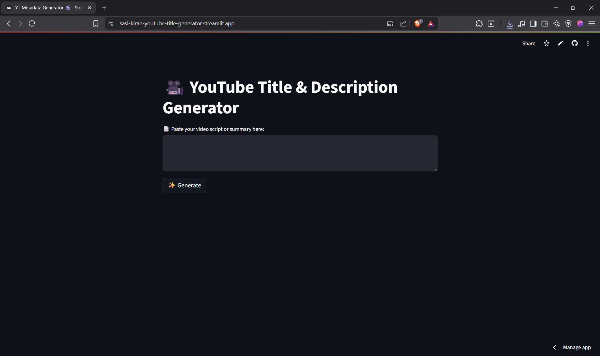
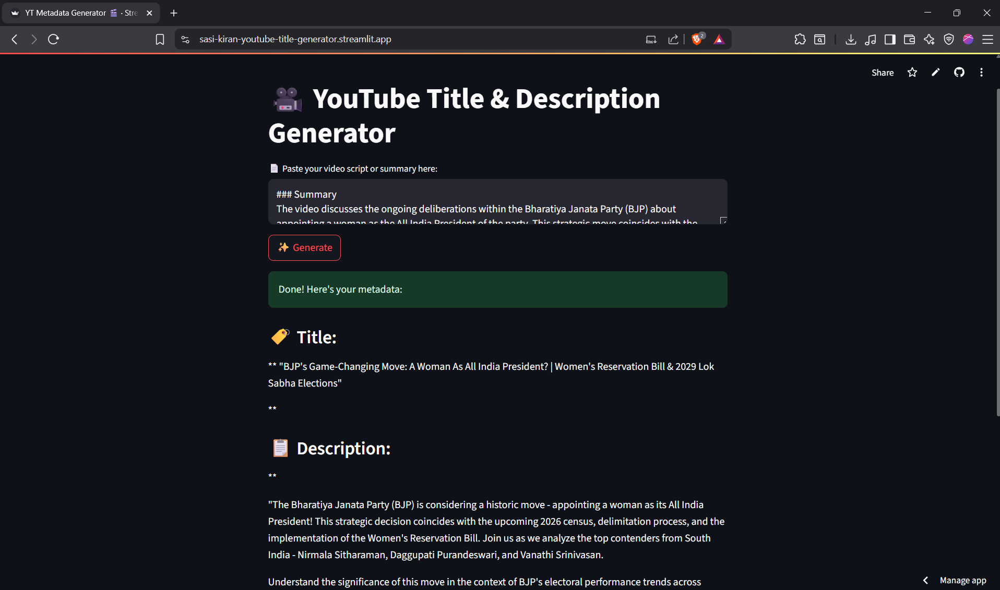
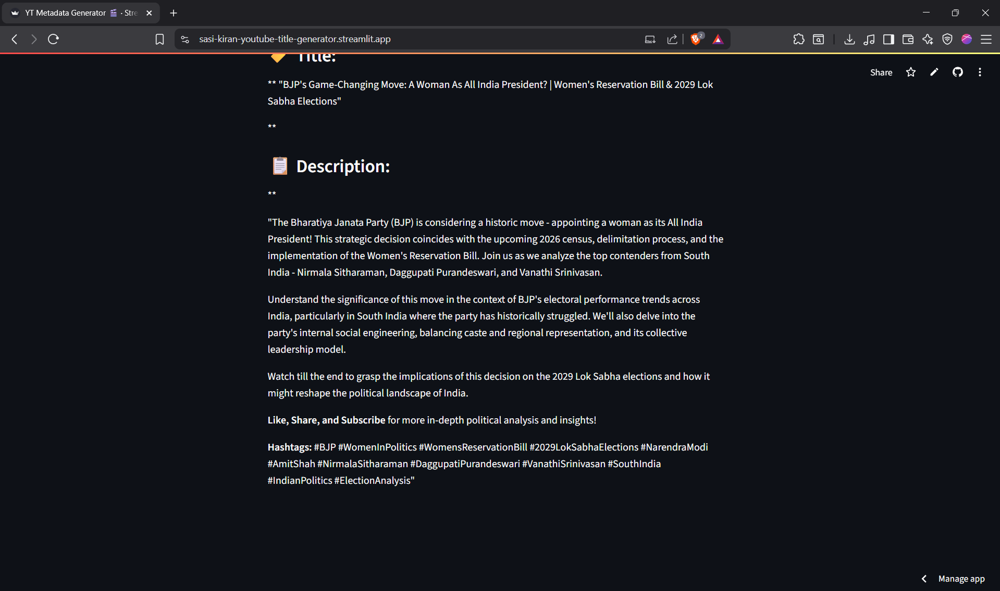

# 🎬 YouTube Title & Description Generator

**Generate catchy, SEO-optimized YouTube titles and descriptions from video scripts using LLaMA 3 by Groq.**  
Perfect for content creators looking to boost engagement with AI-generated metadata! 😄❤️

---

## 🚨 IMPORTANT BEFORE YOU START

⚠️ Whether you're running **locally** or **on Streamlit Cloud**, read these first:

- ✅ You **MUST** get a **Groq API Key**:  
  → https://console.groq.com/keys

- ❌ **Do NOT** push `.env` (your API key) to GitHub!  
  Use `.gitignore` to exclude it.

- ✅ If deploying to **Streamlit Cloud**, you **MUST** set your API key under **Secrets**:
  ```toml
  GROQ_API_KEY = "your_api_key_here"
  ```

💣 Forgetting the secret is the most common reason the app fails to load or generate results!

---

## 🚀 Features

🔥 Uses Groq's ultra-fast LLaMA 3 model  
🧠 Analyzes video scripts to generate optimized metadata  
💻 Simple, elegant Streamlit UI  
🏷️ Generates SEO-rich descriptions with CTAs & hashtags  
☁️ Fully deployable on Streamlit Cloud  

---

## 📦 Project Structure

```
yt-title-generator/
├── app.py            # Streamlit UI logic
├── groq_api.py       # API call to Groq + prompt formatting
├── requirements.txt  # All Python dependencies
├── .gitignore        # Tells Git to ignore .env
└── .env              # (NOT tracked) Your private API key
```

---

## 🧰 Tech Stack

| Tool       | Purpose                        |
|------------|--------------------------------|
| Streamlit  | Frontend UI                    |
| Groq API   | LLaMA 3 backend text generation|
| Python     | Core logic                     |
| dotenv     | Secret key management          |

---

## 🧪 Demo

**1. **


**2.**


**3.**


🔗 [Live App on Streamlit](https://sasi-kiran-youtube-title-generator.streamlit.app/)

---

## 🛠️ Local Setup (Run on your PC)

```bash
# 1. Clone the repo
git clone https://github.com/your-username/yt-title-generator.git
cd yt-title-generator

# 2. Install dependencies
pip install -r requirements.txt

# 3. ⚠️ Add your Groq API key to a `.env` file
echo GROQ_API_KEY=your_api_key_here > .env

# 4. Run the app
streamlit run app.py
```

> ⚠️ DO NOT commit `.env` to GitHub. Your key will get blocked!

---

## ☁️ Streamlit Cloud Deployment

🔹 Steps to deploy this app live using Streamlit Cloud:

- Push only safe files to GitHub (`app.py`, `groq_api.py`, `requirements.txt`)
- Make sure `.env` is ignored via `.gitignore`:
  ```
  .env
  ```
- Go to Streamlit Cloud → Create a new app
- Select your GitHub repo & `app.py` file
- ✅ Go to **Settings > Secrets** and add:
  ```toml
  GROQ_API_KEY = "your_actual_groq_api_key"
  ```
- 🔄 Wait for it to redeploy

🎉 Your app will now be LIVE!

> ⚠️ Missing the secret will crash your deployed app! Always check the Secrets tab if things don't work.

---

## 📋 Example Output

**Input:**
```
For a sample i have mentioned a input in the assets in sampleinput1 file .
```
**Output:**
```
And the output is in the assets as well in sampleoutput1 file
```
---

## 🧠 How It Works

- User pastes a YouTube script or idea
- Prompt is sent to Groq's LLaMA 3 model
- The model responds with:
  - 🎯 Catchy Title
  - 📄 SEO-optimized Description (with hashtags + CTAs)

---

## ✅ To-Do / Improvements

- Auto-publish to YouTube via YouTube Data API  
- Export results to `.txt` or `.csv`  
- Add Google Sheets or MongoDB logging  
- Multi-language support (English, Hindi, Tamil, etc.)

---

## 🤝 Credits

👨‍💻 Built by [@iamsasikiran](https://github.com/iamsasikiran)  
🧠 Powered by Groq  
🎨 UI crafted with Streamlit

---

## 📜 License

MIT License  
Feel free to fork, remix, and share (with love and proper credit)! 😊❤️
